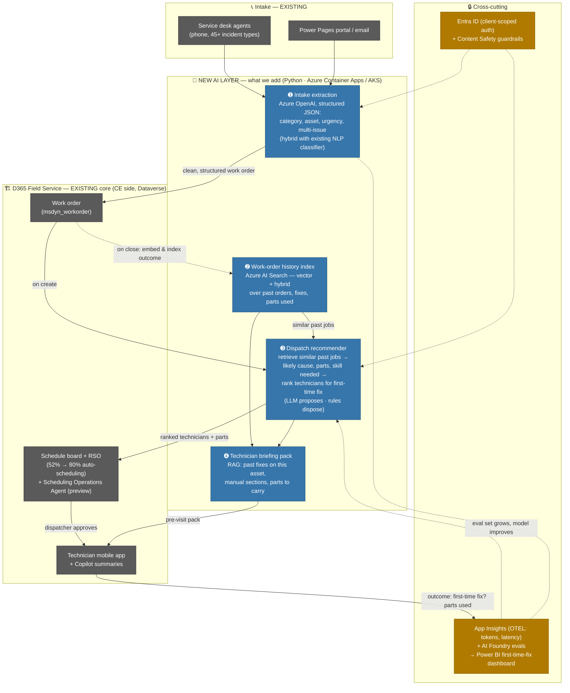
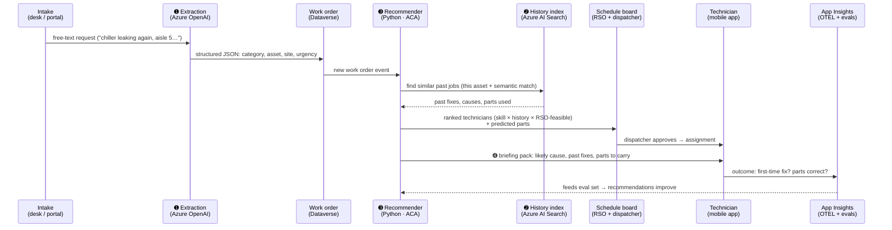

# Work Order Management — AI-Enhanced Dispatch Architecture (Target Case)

> **Target state (their own words):** *"Work Order Management: AI-enhanced systems automate technician dispatching based on past orders, skills, and priorities, improving first-time fix rates."*
> **Source:** [cityfm.com](https://www.cityfm.com/) · [cityfm.us/blog/facilities-management-technology/](https://www.cityfm.us/blog/facilities-management-technology/)
> **Design principle:** extend the existing D365 Field Service estate — buy what Microsoft ships, build only where City FM's own data (past orders, fix history, parts, skills) differentiates. **North-star metric: first-time fix rate.
>
> [www.youtube.com/watch?v=GD7MnIwAxYM
> (ai.azure.com)](https://www.youtube.com/watch?v=GD7MnIwAxYM)

## Current building blocks (documented, public record)

| Existing block                                                                                                                                                                                                                                                                                                                   | Evidence                                                                                                                                                |
| -------------------------------------------------------------------------------------------------------------------------------------------------------------------------------------------------------------------------------------------------------------------------------------------------------------------------------- | ------------------------------------------------------------------------------------------------------------------------------------------------------- |
| **D365 Field Service** — work orders (`msdyn_workorder` on Dataverse, CE side), schedule board, technician dispatch                                                                                                                                                                                                     | [MS customer story](https://www.microsoft.com/en/customers/story/1805026824796117226-cityfm-dynamics-365-finance-professional-services-en-united-states) |
| **RSO (Resource Scheduling Optimization)** — rule-based auto-scheduling, **0% → 52%, targeting 80%**                                                                                                                                                                                                               | same story                                                                                                                                              |
| **Power Pages** customer/vendor portals; **Power BI** reporting; **Teams** approvals (70% of managers)                                                                                                                                                                                                         | same story                                                                                                                                              |
| **Copilot in Field Service** — work-order summarization, creation from email (platform features, available to enable)                                                                                                                                                                                                     | [MS Learn](https://learn.microsoft.com/en-us/dynamics365/release-plan/2026wave1/service/dynamics365-field-service/)                                      |
| **Scheduling Operations Agent (preview)** — natural-language schedule optimization, expanding in 2026 wave 1                                                                                                                                                                                                              | [MS Learn](https://learn.microsoft.com/en-us/dynamics365/field-service/soa-run)                                                                          |
| **"An NLP process"** — work-order/incident classification (per Vaishali; hosting unknown — see Q1 guess in Onsite-Round2-Prep.md)                                                                                                                                                                                        | interview intel                                                                                                                                         |
| ❓**Mercury CAFM** — UK service-desk system; **relationship to the Field Service work-order estate is an OPEN QUESTION — deliberately NOT assumed in this design.** Ask on the day: *"Where does Mercury sit relative to Field Service work orders — parallel estates by region, or integrated via Dataverse?"* | [service-desk page](https://www.cityfm.com/insights/service-desk-overview/)                                                                              |

## The full picture — existing estate + the AI we add

**Legend:** ⬛ **grey = exists today** (D365 Field Service estate — configure/extend, don't rebuild) · 🔵 **blue = the AI we add** (Python, containerised, numbered ➊–➍ to match the phased story in Onsite-Round2-Prep.md Part A) · 🟨 **amber = cross-cutting** (security, observability, evals).

**The one-sentence read of this diagram:** *"Everything grey already exists and stays; the four blue boxes are the entire build — and each one lands value on its own before the next starts."*

## Dispatch-time flow (what happens on one work order)

## Block-by-block: AWS equivalent · language/tech · your existing analog

| AWS equivalent (your mental map)                          | Block                                                   | You'd write / configure                     | Language & tech                            | Your analog (say this)                    |
| --------------------------------------------------------- | ------------------------------------------------------- | ------------------------------------------- | ------------------------------------------ | ----------------------------------------- |
| **Amazon Bedrock**                                  | Azure OpenAI (➊ extraction, ➌ generation, embeddings) | Consume                                     | Managed · Python SDK                      | Ollama / any LLM API                      |
| **Amazon OpenSearch (vector) / Kendra**             | Azure AI Search (➋ history index)                      | Configure + consume                         | Managed · Python SDK/REST                 | FAISS/Weaviate/Chroma                     |
| **Amazon SageMaker endpoint**                       | Azure ML (existing NLP model hosting, if custom)        | Integrate                                   | Managed · Python                          | Model serving generally                   |
| **AWS Lambda**                                      | Azure Functions (index-on-close pipeline)               | **Write** (small)                     | **Python**                           | md-mcp chunking pipeline                  |
| **Amazon S3**                                       | Azure Blob Storage (manuals, docs)                      | Consume                                     | Storage · any SDK                         | S3 (you know this one)                    |
| **ECS Fargate / EKS**                               | Azure Container Apps / AKS (➌ recommender + API host)  | **Write + deploy**                    | **Python** · FastAPI, containerised | Your Docker/EKS Wiz service — direct hit |
| **Bedrock Guardrails**                              | Azure AI Content Safety                                 | Consume                                     | Managed · REST                            | Your guardrails layer                     |
| **IAM Identity Center / Cognito**                   | Microsoft Entra ID                                      | Configure                                   | OAuth2/OIDC                                | Any IdP                                   |
| **CloudWatch + X-Ray**                              | Azure Monitor / App Insights                            | Instrument                                  | **OpenTelemetry from Python**        | Your OTEL+Grafana stack — direct hit     |
| **Bedrock model evaluation**                        | AI Foundry evals                                        | Configure                                   | Managed + Python                           | Your eval-set discipline                  |
| **Amazon QuickSight**                               | Power BI (first-time-fix dashboard)                     | Consume/report                              | Low-code BI                                | Grafana/Tableau                           |
| **Step Functions + EventBridge**                    | Power Automate (WO event triggers)                      | Configure                                   | Low-code workflow                          | GitLab pipeline triggers                  |
| **Amazon Q / Bedrock Agents**                       | Copilot in Field Service + Scheduling Operations Agent  | **Enable/configure** (buy, not build) | Platform features                          | — the "buy" half of buy-vs-build         |
| *(no AWS equivalent — SaaS app; think ServiceNow FSM)* | D365 Field Service + RSO + schedule board               | Extend via events/APIs                      | SaaS · OData/Dataverse events             | Consuming any enterprise API              |
| *(no AWS equivalent — SaaS data platform)*             | Dataverse (`msdyn_workorder`, row-level security)     | Integrate                                   | SaaS · OData REST / connectors            | Your app DB, but managed                  |
