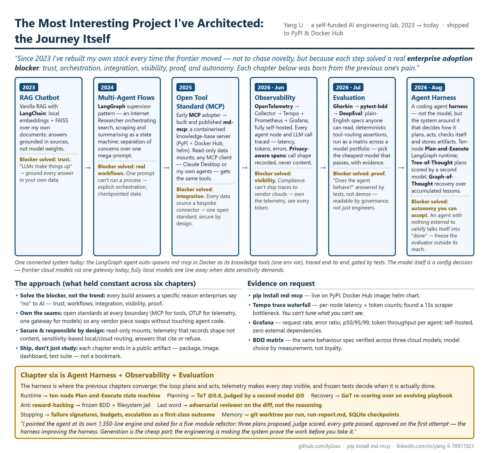
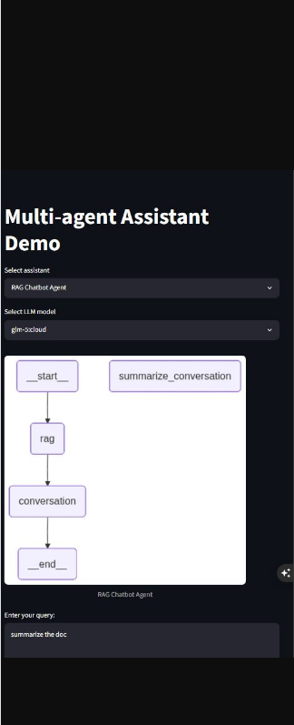

# public-demo

An AI engineering journey, 2023 → today.

| File | What it is |
| --- | --- |
| [demo.md](demo.md) | The journey, one full screenshot per chapter |
| [demo1.md](demo1.md) | The journey, one-pager beside each chapter's screenshot |
| [OnePager-LocalFirst-AI-Stack.html](OnePager-LocalFirst-AI-Stack.html) | **Source of truth** for the one-pager |
| [common-left.png](images/common-left.png) | **Generated** from that HTML — do not edit by hand |
| [Stack-Structure-CallFlow.md](Stack-Structure-CallFlow.md) | Architecture + call-flow diagrams |

---

## Regenerating the one-pager image

`images/common-left.png` is the left-hand pane in every row of [demo1.md](demo1.md). It is a
screenshot of `OnePager-LocalFirst-AI-Stack.html`, produced by
[render_onepager.py](render_onepager.py). **Edit the HTML, then re-render** — never touch
the PNG directly, it gets overwritten.

```bash
uv run render_onepager.py
```

That's the whole workflow. `uv` reads the dependency list embedded at the top of the
script (PEP 723) and provisions Pillow into a throwaway environment on first run — no
`pip install`, no virtualenv to manage.

### If you don't have uv

```bash
winget install --id=astral-sh.uv -e
```

Or use plain Python, installing the one dependency yourself:

```bash
pip install pillow
```

```bash
python render_onepager.py
```

### What it does

Drives the Chrome (or Edge) already installed on the machine in headless mode:
renders the HTML at 1005 CSS px wide, captures at 2× device scale for a crisp image,
then trims the blank page area below the content. No Playwright, no browser download.

Knobs at the top of the script:

| Constant | Default | Effect |
| --- | --- | --- |
| `WIDTH` | `1005` | Layout width in CSS px — the one-pager's column widths follow this |
| `SCALE` | `2` | Device pixel ratio; `1` gives a smaller, softer file |
| `MAX_HEIGHT` | `1600` | Canvas height before trimming; raise it if content is cut off |
| `BROWSERS` | Chrome, Edge | Add your browser's path if neither is in the default location |

If it exits with `No Chrome or Edge found`, add the correct path to `BROWSERS`.

---

## Auto-render on commit (optional)

To make it impossible for the PNG to drift from the HTML, point git at the
tracked [hooks/](hooks/) directory:

```bash
git config core.hooksPath hooks
```

Verify it took — an empty result means the hook is **not** active and commits will
silently skip re-rendering:

```bash
git config core.hooksPath
```

This setting lives in `.git/config`, which is neither tracked nor cloned, so it must be
run once **per clone, on every machine**. From then on, any commit that stages
`OnePager-LocalFirst-AI-Stack.html` re-renders `images/common-left.png` and stages it
alongside — so the image and its source always land in the same commit. Commits that
don't touch the HTML are unaffected.

The hook prefers `uv` and falls back to `python`. To bypass it once:

```bash
git commit --no-verify
```

To stop using it:

```bash
git config --unset core.hooksPath
```

---

## Why the images are laid out in tables

GitHub's Markdown sanitizer keeps `style` on `` but **strips it from `<div>`**, so a
`<div style="display: flex">` row silently collapses and the two images stack vertically
on github.com. Each chapter in [demo1.md](demo1.md) therefore uses a one-row, two-cell
HTML table, which survives sanitizing intact:

```html
<table><tr>
<td width="50%"></td>
<td width="50%"></td>
</tr></table>
```

For the same reason, the one-pager can't be inlined into the Markdown as live HTML:
`<style>`, `<iframe>` and `<script>` are not in GitHub's allowlist. Rendering it to a PNG
is the only approach that works on github.com — hence the script above.
