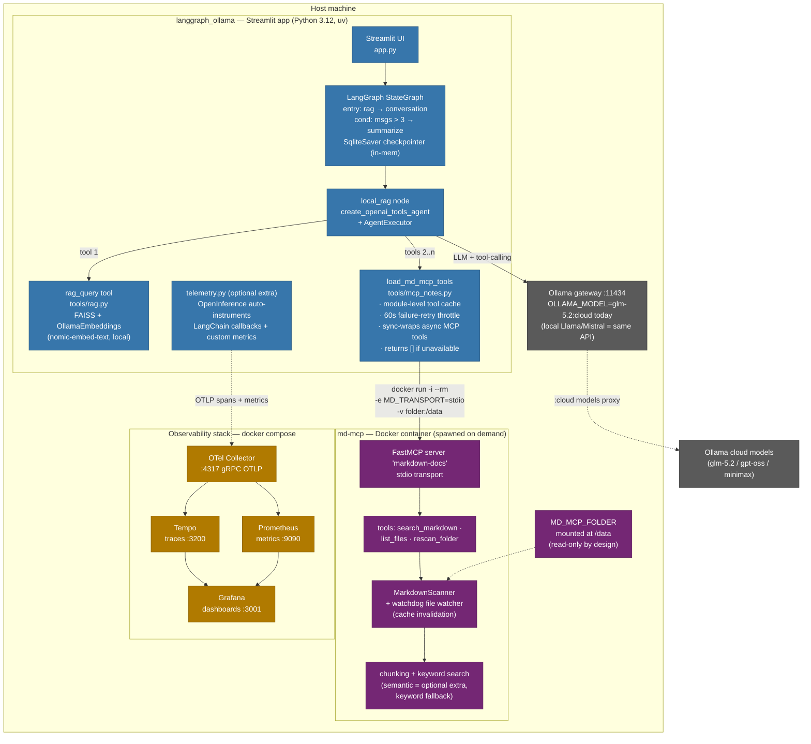
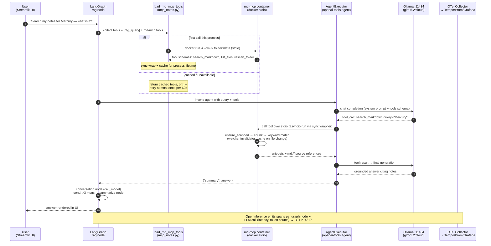

# langgraph_ollama × md-mcp — Structure & Call Flow (as the code actually is)

> Drawn from source audit 14 Jul 2026: `app.py`, `rag_research_chatbot.py`, `tools/mcp_notes.py`, `tools/rag.py`, `telemetry.py` (langgraph_ollama) · `server.py`, `scanner.py`, `chunking.py`, `semantic.py`, `telemetry.py` (md_mcp).
> Use: your own deep-dive reference if Ross asks "so how does it actually work?" — every box below exists in code.

## 1 · Structure (static view)

## 2 · Call flow (one query, dynamic view)

## 3 · Design details worth saying out loud (all true in code)

- **Graceful degradation everywhere:** no `MD_MCP_FOLDER` → `[]`, app unchanged; container missing → warn, `[]`, retry ≤1/min; OTel packages missing or collector down → telemetry is a no-op, never breaks the app.
- **The whole integration is one env var** — `MD_MCP_FOLDER=path`. The loader spawns `docker run --rm` per session (stdio), so there's no daemon to manage and nothing persists.
- **Caching at the right layers:** tool schemas cached per process (Streamlit reruns the script per interaction — discovery would otherwise round-trip every click); md-mcp caches its scan and invalidates via the file watcher.
- **Async/sync seam handled explicitly:** MCP adapter tools are async-only; the AgentExecutor path is sync — hence the `StructuredTool` sync wrapper running `asyncio.run` per call.
- **Security posture:** `/data` mount read-only (embeddings cache relocated via `MD_CACHE_DIR` to keep it so); md-mcp telemetry records call *shape* not content, and only activates when an OTLP endpoint is explicitly configured.
