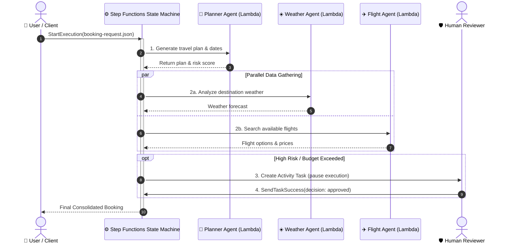
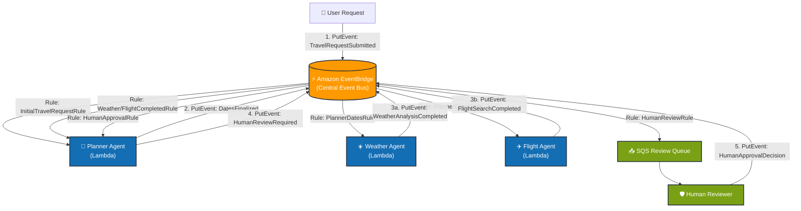

# Multi-Agent Coordination Patterns on AWS: Orchestration vs. Choreography

This document provides an in-depth architectural comparison between **Orchestration (AWS Step Functions)** and **Choreography (Amazon EventBridge)** for coordinating distributed AI agents.

---

## 1. Visual Architecture Diagrams

### Pattern A: Orchestration (AWS Step Functions) — Central "Conductor"

---

### Pattern B: Choreography (Amazon EventBridge) — Event-Driven "Dancers"

---

## 2. Core Differences

| Dimension | **Orchestration (AWS Step Functions)** | **Choreography (Amazon EventBridge)** |
| :--- | :--- | :--- |
| **Reference Guide** | [`Orchestration-StepFunction.md`](./Orchestration-StepFunction.md) | [`Choreopgraphy-EventBridge.md`](./Choreopgraphy-EventBridge.md) |
| **Mental Model** | **Conductor & Orchestra**: The central state machine explicitly commands each agent. | **Dancers & Music**: Agents autonomously react to events published on the bus. |
| **Control Flow** | **Centralized**: Explicitly defined in Amazon States Language (ASL JSON). | **Decentralized**: Distributed across EventBridge rules and event patterns. |
| **Coupling** | **Tighter**: The state machine knows all agents, input/output schemas, and execution order. | **Loose**: Agents only know about the event schemas they emit and consume. |
| **State Management** | **Centralized & Built-in**: Execution state, history, and context pass through state machine execution. | **Decentralized**: Each agent manages its own state (or persists state to DynamoDB/S3). |
| **Human-in-the-Loop (HITL)** | **Native Task Tokens**: Uses Step Functions `Activity` or `.waitForTaskToken` callbacks. | **Asynchronous Queue**: Emits `HumanReviewRequired` to SQS; receives `HumanApprovalDecision` event. |
| **Error Handling & Retries** | Configured centrally in ASL with `Retry` and `Catch` blocks, plus compensation steps. | Decentralized using SQS Dead Letter Queues (DLQs) and per-agent retry policies. |
| **Observability** | Single visual graph in Step Functions Console tracking execution paths, inputs, and outputs. | Distributed log streams in CloudWatch using correlation IDs (`bookingID`) and X-Ray tracing. |
| **Extensibility** | Adding a new agent requires updating the ASL JSON definition and IAM execution roles. | Adding a new agent requires only adding a new EventBridge rule; no existing agent code is changed. |

---

## 3. Deep-Dive Comparison by Workflow Stage

### 3.1 Invocation & Coordination
- **Step Functions**: 
  - Starts with `aws stepfunctions start-execution --input file://high-risk-booking.json`.
  - Step Functions sequentially invokes `PlannerAgent`, then triggers `Parallel` branches for `WeatherAgent` and `FlightManagerAgent`, and aggregates their JSON responses into execution state.
- **EventBridge**: 
  - Starts by publishing an event: `aws events put-events --entries '[{"DetailType": "TravelRequestSubmitted", ...}]'`.
  - `InitialTravelRequestRule` routes to `PlannerAgent`. `PlannerAgent` finishes and puts a `DatesFinalized` event back onto the bus. `PlannerDatesRule` routes that event in parallel to both `WeatherAgent` and `FlightManagerAgent`.

### 3.2 Human-in-the-Loop (HITL) Review
- **Step Functions**:
  - The state machine enters a state with `Resource: "arn:aws:states:::activity:human-review"`. Execution is paused.
  - Reviewer polls the task via `aws stepfunctions get-activity-task`, reviews risk parameters, and calls `aws stepfunctions send-task-success --task-token "$TASK_TOKEN" --task-output '{"decision":"approved"}'` to resume execution.
- **EventBridge**:
  - The `PlannerAgent` evaluates risk and emits a `HumanReviewRequired` event.
  - `HumanReviewRule` captures this event and enqueues it to an Amazon SQS queue (`multi-agent-human-review`).
  - An admin pulls from SQS, reviews, and publishes a new event: `DetailType: "HumanApprovalDecision"`. `HumanApprovalRule` routes the decision back to `PlannerAgent` to continue.

---

## 4. When to Choose Which Pattern

### Choose **Orchestration (Step Functions)** when:
1. **Strict Workflow Dependencies**: Steps must strictly execute in a predefined order (e.g. KYC verification $\rightarrow$ risk assessment $\rightarrow$ payment $\rightarrow$ ticket issuance).
2. **End-to-End Visual Auditability**: You need a single visual pane of glass to debug failed executions, trace step-level inputs/outputs, and inspect execution durations.
3. **Complex Error Recovery / Saga Pattern**: You require automated compensation transactions (e.g., if Flight fails, automatically roll back Hotel booking).
4. **Single-Domain or Workflow-Scoped Agents**: The agents are closely collaborating to achieve a single business transaction.

### Choose **Choreography (EventBridge)** when:
1. **Cross-Domain / Microservices Integration**: Different teams build and own independent agents (e.g. Travel Team, Loyalty Team, Fraud Team, Marketing Notification Team).
2. **High Extensibility & Plug-and-Play**: You want to add new downstream listeners (e.g. Analytics, Real-time Dashboard, Notification Service) without touching the core workflow or redeploying existing agents.
3. **Event-Driven & Asynchronous**: Tasks are decoupled in time and don't require an active lock on a single synchronous transaction thread.

---

## 5. The Enterprise Best Practice: Hybrid Architecture

In production multi-agent systems, organizations often combine both patterns:
- **EventBridge at the Macro Level (Cross-System Choreography)**: Used to broadcast domain events across decoupled systems and microservices.
- **Step Functions at the Micro Level (Intra-Agent Orchestration)**: Used within a specific agent domain to orchestrate complex multi-step reasoning, tool execution loops, retry logic, and human approval gates.
