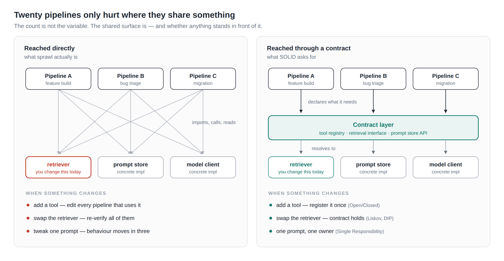

# SOLID at the Platform Layer: Agent Harnesses as Enterprise Software

*Title options: (1) SOLID at the Platform Layer: Agent Harnesses as Enterprise Software · (2) Architecting Reliable AI: Why Your Agent Harness Needs SOLID · (3) The Five Questions I'd Ask Before Approving an Agent Platform*

The first post in this series was about governing one workflow — boundaries the model isn't allowed to cross, and a process that proves it didn't. The second located the five SOLID principles inside a single harness's source, and found three that held, one that half held, and one I had broken on purpose.

This one is about the level above both: what happens when an organisation has several harnesses, built by several teams, and someone has to decide what they are allowed to share.

That is where the principles stop being a matter of taste. Inside one repository, a SOLID violation costs you an afternoon. At the platform layer it costs you a migration.

## The mapping, and where each row is harder than it sounds

| Principle                            | Classic meaning                                                  | Agent harness application                                                                                                      | The part people skip                                                                                                                                                                                                                                                                                                                                                                    |
| ------------------------------------ | ---------------------------------------------------------------- | ------------------------------------------------------------------------------------------------------------------------------ | --------------------------------------------------------------------------------------------------------------------------------------------------------------------------------------------------------------------------------------------------------------------------------------------------------------------------------------------------------------------------------------- |
| **S** — Single Responsibility | One reason to change                                             | Dedicated node roles. Plan generator, code synthesiser and test runner are separate nodes; the Maker is never its own Judge.   | The reason isn't tidiness, it's control. A node that generates and validates has one dial for two behaviours: improve the generation prompt and you have silently moved the validator. Banks call this maker-checker and enforce it in software, not in policy.                                                                                                                         |
| **O** — Open/Closed           | Open for extension, closed for modification                      | A pluggable tool registry. A new tool, linter or retrieval source shouldn't require editing the core state graph.              | Extension points expand the action space. Every tool you make it easy to add is a permission you make it easy to grant. Open for extension must be paired with closed for authority — the registry decides what exists, a separate policy decides what a given run may call.                                                                                                           |
| **L** — Liskov Substitution   | Subtypes stand in for their base type without breaking behaviour | Provider and model agnosticism: swap one model for another behind a stable harness contract.                                   | This is the row that lies. Two models satisfy the same*interface* and fail the same *contract* — structured output that parses 99% of the time versus 87%, a context window that silently truncates, a refusal style your parser reads as an empty plan. Substitutability for a model is a behavioural claim, and the only way to make it is an eval suite that runs against both. |
| **I** — Interface Segregation | No client depends on what it doesn't use                         | Fine-grained context injection: give a sub-task the narrow schema it needs, not the whole codebase and fifty tool definitions. | For an LLM, context*is* the interface — and unlike a fat Java interface, a fat prompt costs money and accuracy on every single call. Interface Segregation is the one principle here with a per-invocation price tag, which is why it's the easiest to sell and the most often ignored.                                                                                              |
| **D** — Dependency Inversion  | Depend on abstractions, not concretions                          | Nodes talk to a model client, a tool registry and a run store — never to a vendor SDK, a specific endpoint or a named secret. | A message broker is not an abstraction; it's a concretion with a queue in front of it. The abstraction is the interface your nodes are written against. Get that right and the transport — in-process state, Redis, Kafka — becomes a deployment decision rather than a rewrite.                                                                                                      |

## The two rows worth an argument

**Liskov is where model swaps lie to you.** The industry sells provider-agnosticism as a configuration flag, and at the API level it nearly is. But Liskov was never about signatures; it was about a subtype honouring the promises the base type made. A model that returns valid JSON 87% of the time where its predecessor returned it 99% of the time has kept the signature and broken the contract, and your harness will discover this at three in the morning in the form of a retry loop.

The engineering answer is unglamorous and it's the same one we've used for twenty years: contract tests. For a harness, the contract test is a frozen eval set — a fixed corpus of tasks with known-good outcomes, run against any candidate model before it's allowed behind the interface. Not a benchmark score; your own tasks, your own gates, pass/fail. Until that exists, "model agnostic" means "we haven't found out yet".

**Interface Segregation has a meter running.** Dumping the repository into context is the agentic equivalent of one interface with ninety methods, except you are billed per method per call and accuracy degrades as the interface grows. Narrow the context to the schema a sub-task needs and three things improve at once: cost, latency and the model's odds of doing the right thing. I know of no other design principle where the argument to a CFO and the argument to an engineer are the same sentence.

## Where SOLID runs out

An honest version of this post has to say what the five principles don't cover, because an agent platform fails in ways object-oriented design never had to think about.

- **Nondeterminism.** SOLID assumes a component behaves the same way twice. Yours doesn't. Evals are the regression suite; without them you have architecture with no way to know it's still working.
- **Cost and latency as first-class constraints.** No SOLID principle tells you a design is too expensive. Budgets — wall-clock, attempts, tokens — are structural decisions and belong in the harness contract, not in a monitoring dashboard.
- **Blast radius.** A well-factored component with filesystem access and no sandbox is a well-factored disaster. Isolation (worktrees, jails, scoped credentials) is orthogonal to coupling, and more urgent.
- **Provenance.** Two teams will eventually disagree about what an agent did. If a run doesn't produce a state snapshot and a report, you have no way to settle it. Auditability is a design requirement, not an operational nicety.

## The platform question

Here's what actually changes when a second team builds a harness.

*[ insert shared-layer diagram — shared-layer.png ]*

Isolated harnesses that share nothing don't create coupling; they create duplication, which is a cheaper problem. Coupling begins the moment two harnesses reach for the same retriever, the same prompt library, the same model client. And that moment always arrives, because nobody maintains four copies of a retrieval stack.

So the platform decision is not *whether* to share, it's *what stands in front of the shared thing*. Direct imports mean every consumer is in the blast radius of every change. A contract layer — a model gateway with named roles rather than model IDs, a tool registry with a policy hook, a run store with a versioned schema — means change lands in one place and is verified once.

That is the whole of Dependency Inversion, drawn at the org chart.

## What I'd standardise across teams

If I were setting the architectural standards for agentic infrastructure — and this is the list I would actually defend in a design review:

1. **Uniform node contract.** Every node has the same shape. It's what makes a graph reroutable rather than hand-wired, and it's free if you decide it on day one.
2. **A model gateway with named roles, not model names.** Nodes ask for `primary` or `judge`. Which model that resolves to is configuration, and swapping it requires an eval pass.
3. **A tool registry with a policy layer.** Adding a tool is a pull request against the registry. Granting a run access to it is a separate decision with a separate approver.
4. **Frozen acceptance criteria per run.** The definition of done is authored before the work starts and cannot be edited by the thing doing the work. Whatever else you copy from this series, copy that one.
5. **One run artefact format.** Every run, successful or escalated, emits the same report and state snapshot. This is what makes twenty harnesses observable by one team instead of twenty.

None of this makes the model more reliable. It makes the system around the model something you can still change in six months — which, when the model is the one component you cannot debug, is the only lever you actually own.
