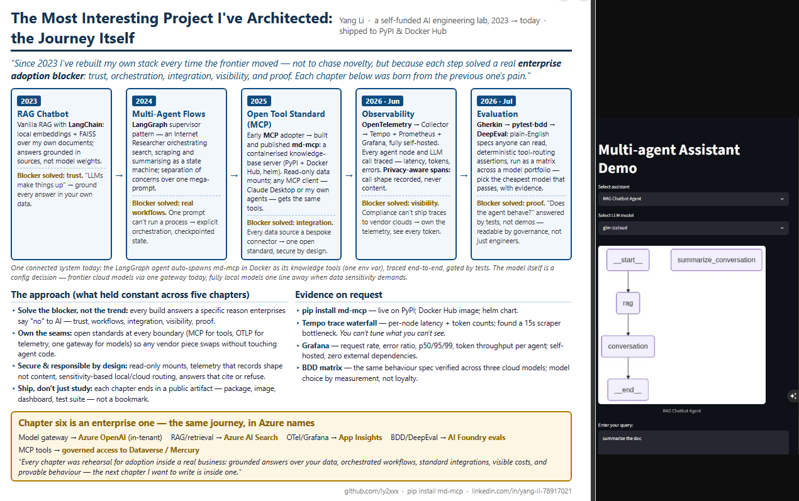
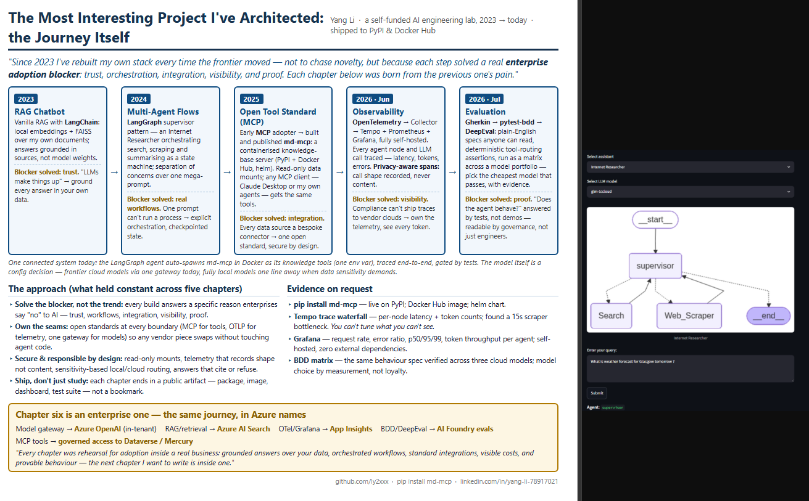
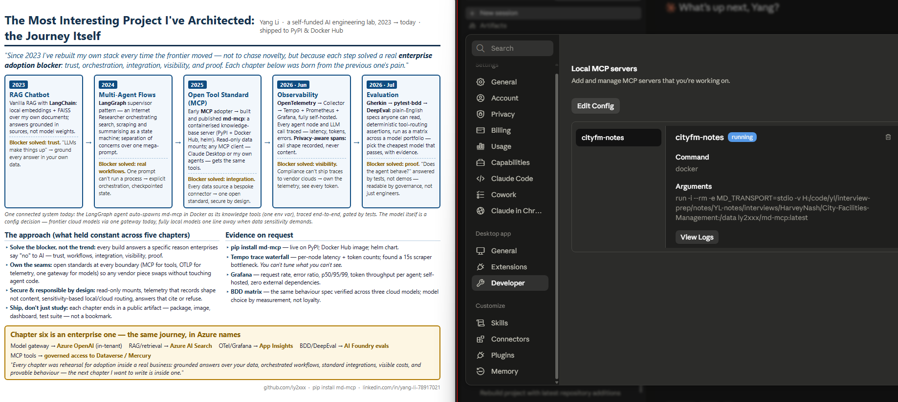
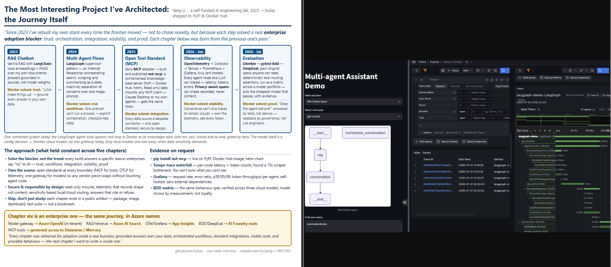
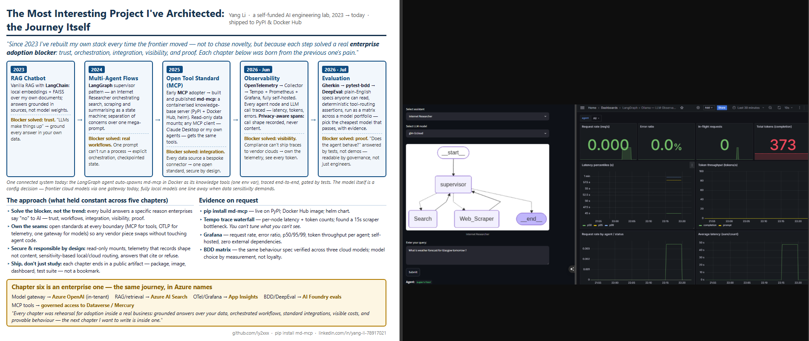
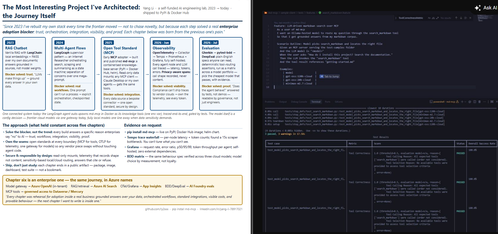
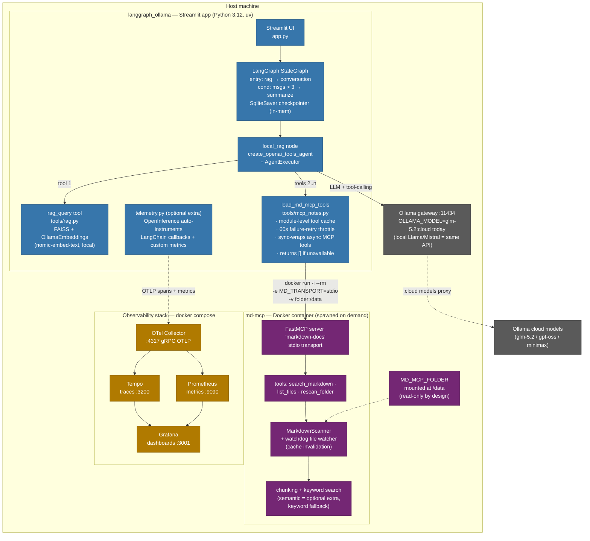

# An AI Engineering Journey - [github.com/ly2xxx/public-demo/blob/main/demo.md](https://github.com/ly2xxx/public-demo/blob/main/demo.md)

---

## 2023: RAG Chatbot

---

## 2024: Multi-Agent Flows

---

## 2025: Open Tool Standard (MCP)

---

## 2026: Observability

---

## 2026: Observability Dashboards

---

## 2026: Evaluation & BDD

## 1 · Structure (static view)

---
